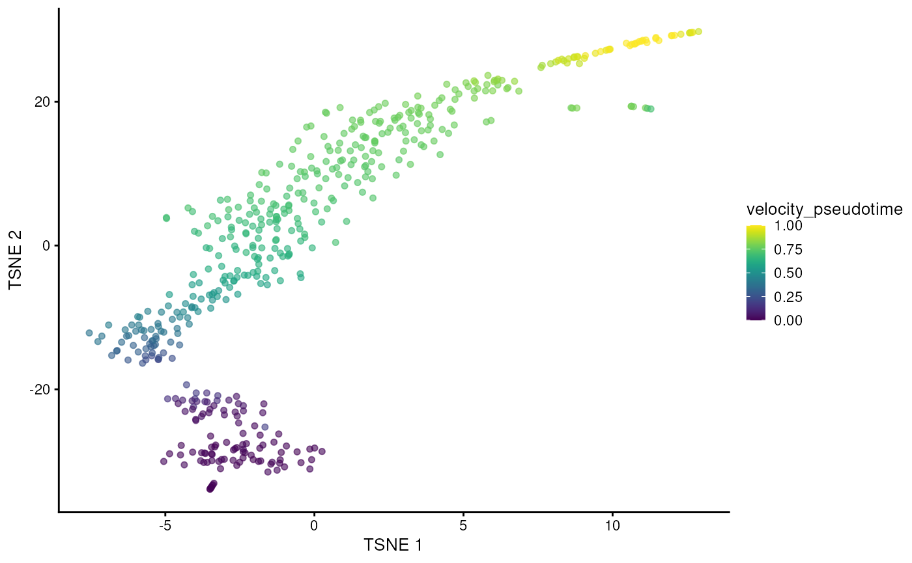
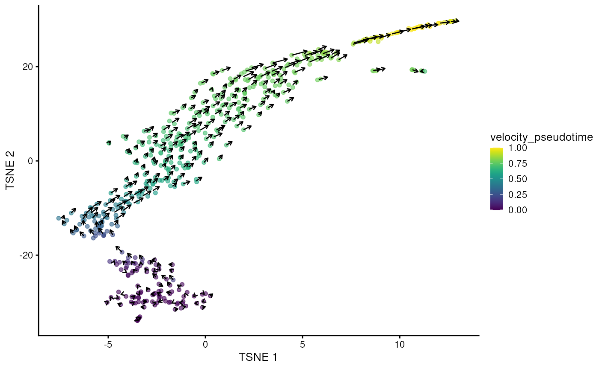

# Computing RNA velocity in a Bioconductor framework

## Overview

This package provides a lightweight interface between the Bioconductor
`SingleCellExperiment` data structure and the
[scvelo](https://pypi.org/project/scvelo) Python package for RNA
velocity calculations. The interface is comparable to that of many other
`SingleCellExperiment`-compatible functions, allowing users to plug in
RNA velocity calculations into the existing Bioconductor analysis
framework. To demonstrate, we will use a data set from Hermann et al.
(2018), provided via the
*[scRNAseq](https://bioconductor.org/packages/3.23/scRNAseq)* package.
This data set contains gene-wise estimates of spliced and unspliced UMI
counts for 2,325 mouse spermatogenic cells.

``` r

library(scRNAseq)
sce <- HermannSpermatogenesisData()
sce
```

    ## class: SingleCellExperiment 
    ## dim: 54448 2325 
    ## metadata(0):
    ## assays(2): spliced unspliced
    ## rownames(54448): ENSMUSG00000102693.1 ENSMUSG00000064842.1 ...
    ##   ENSMUSG00000064369.1 ENSMUSG00000064372.1
    ## rowData names(0):
    ## colnames(2325): CCCATACTCCGAAGAG AATCCAGTCATCTGCC ... ATCCACCCACCACCAG
    ##   ATTGGTGGTTACCGAT
    ## colData names(1): celltype
    ## reducedDimNames(0):
    ## mainExpName: NULL
    ## altExpNames(0):

## Downsampling for demonstration

The full data set requires up to 12 GB of memory for the example usage
presented in this vignette. For demonstration purposes, we downsample
the data set to the first 500 cells. Feel free to skip this downsampling
step if you have access to sufficient memory.

``` r

sce <- sce[, 1:500]
```

## Basic workflow

We assume that feature selection has already been performed by the user
using any method (see
[here](https://osca.bioconductor.org/feature-selection.html) for some
suggestions). In this case, we will use the variance of log-expressions
from *[scran](https://bioconductor.org/packages/3.23/scran)* to select
the top 2000 genes.

``` r

library(scuttle)
sce <- logNormCounts(sce, assay.type=1)

library(scran)
dec <- modelGeneVar(sce)
top.hvgs <- getTopHVGs(dec, n=2000)
```

We can plug these choices into the
[`scvelo()`](https://kevinrue.github.io/velociraptor/reference/scvelo.md)
function with our `SingleCellExperiment` object. By default,
[`scvelo()`](https://kevinrue.github.io/velociraptor/reference/scvelo.md)
uses the steady-state approach to estimate velocities, though the
stochastic and dynamical models implemented in
[scvelo](https://pypi.org/project/scvelo) can also be used by modifying
the `mode` argument.

Note that automatic neighbor calculation is deprecated since
scvelo==0.4.0 and will be removed in a future version. Instead,
*[velociraptor](https://bioconductor.org/packages/3.23/velociraptor)*
computes neighbors with Scanpy (as per [scVelo
recommendations](https://github.com/theislab/scvelo/blob/f21651c3b122860d8ae6b5a5173f242ba91c8761/scvelo/preprocessing/moments.py#L66)),
and the number of neighbors should be supplied to
[scanpy.pp.neighbors](https://scanpy.readthedocs.io/en/stable/api/generated/scanpy.pp.neighbors.html)
as demonstrated below.

In particular, the default number of neighbors was 30 for
[scvelo.pp.moments](https://scvelo.readthedocs.io/en/stable/scvelo.pp.moments.html)
while it is 15 for
[scanpy.pp.neighbors](https://scanpy.readthedocs.io/en/stable/api/generated/scanpy.pp.neighbors.html).
Users should use `scvelo.params=list(neighbors=list(n_neighbors=30L)` to
reproduce earlier results.

``` r

library(velociraptor)
velo.out <- scvelo(
  sce, subset.row=top.hvgs, assay.X="spliced",
  scvelo.params=list(neighbors=list(n_neighbors=30L))
)
```

    ## computing moments based on connectivities
    ##     finished (0:00:00) --> added 
    ##     'Ms' and 'Mu', moments of un/spliced abundances (adata.layers)
    ## computing velocities
    ##     finished (0:00:00) --> added 
    ##     'velocity', velocity vectors for each individual cell (adata.layers)
    ## computing velocity graph (using 1/4 cores)
    ## WARNING: Unable to create progress bar. Consider installing `tqdm` as `pip install tqdm` and `ipywidgets` as `pip install ipywidgets`,
    ## or disable the progress bar using `show_progress_bar=False`.
    ##     finished (0:00:00) --> added 
    ##     'velocity_graph', sparse matrix with cosine correlations (adata.uns)
    ## computing terminal states
    ##     identified 1 region of root cells and 1 region of end points .
    ##     finished (0:00:00) --> added
    ##     'root_cells', root cells of Markov diffusion process (adata.obs)
    ##     'end_points', end points of Markov diffusion process (adata.obs)
    ## --> added 'velocity_length' (adata.obs)
    ## --> added 'velocity_confidence' (adata.obs)
    ## --> added 'velocity_confidence_transition' (adata.obs)

``` r

velo.out
```

    ## class: SingleCellExperiment 
    ## dim: 2000 500 
    ## metadata(4): neighbors velocity_params velocity_graph
    ##   velocity_graph_neg
    ## assays(6): X spliced ... Mu velocity
    ## rownames(2000): ENSMUSG00000117819.1 ENSMUSG00000081984.3 ...
    ##   ENSMUSG00000022965.8 ENSMUSG00000094660.2
    ## rowData names(4): velocity_gamma velocity_qreg_ratio velocity_r2
    ##   velocity_genes
    ## colnames(500): CCCATACTCCGAAGAG AATCCAGTCATCTGCC ... CACCTTGTCGTAGGAG
    ##   TTCCCAGAGACTAAGT
    ## colData names(7): velocity_self_transition root_cells ...
    ##   velocity_confidence velocity_confidence_transition
    ## reducedDimNames(1): X_pca
    ## mainExpName: NULL
    ## altExpNames(0):

In the above call, we use the `"spliced"` count matrix as a proxy for
the typical exonic count matrix. Technically, the latter is not required
for the velocity estimation, but
[scvelo](https://pypi.org/project/scvelo) needs to perform a PCA and
nearest neighbors search, and we want to ensure that the neighbors
detected inside the function are consistent with the rest of the
analysis workflow (performed on the exonic counts). There are some
subtle differences between the spliced count matrix and the typical
exonic count matrix - see
[`?scvelo`](https://kevinrue.github.io/velociraptor/reference/scvelo.md)
for some commentary about this - but the spliced counts are generally a
satisfactory replacement if the latter is not available.

The
[`scvelo()`](https://kevinrue.github.io/velociraptor/reference/scvelo.md)
function produces a `SingleCellExperiment` containing all of the outputs
of the calculation in Python. Of particular interest is the
`velocity_pseudotime` vector that captures the relative progression of
each cell along the biological process driving the velocity vectors. We
can visualize this effect below in a $`t`$-SNE plot generated by
*[scater](https://bioconductor.org/packages/3.23/scater)* on the top
HVGs.

``` r

library(scater)

set.seed(100)
sce <- runPCA(sce, subset_row=top.hvgs)
sce <- runTSNE(sce, dimred="PCA", perplexity = 30)

sce$velocity_pseudotime <- velo.out$velocity_pseudotime
plotTSNE(sce, colour_by="velocity_pseudotime")
```



It is also straightforward to embed the velocity vectors into our
desired low-dimensional space, as shown below for the $`t`$-SNE
coordinates. This uses a grid-based approach to summarize the per-cell
vectors into local representatives for effective visualization.

``` r

embedded <- embedVelocity(reducedDim(sce, "TSNE"), velo.out)
```

    ## computing velocity embedding
    ##     finished (0:00:00) --> added
    ##     'velocity_target', embedded velocity vectors (adata.obsm)

``` r

grid.df <- gridVectors(sce, embedded, use.dimred = "TSNE")

library(ggplot2)
plotTSNE(sce, colour_by="velocity_pseudotime") +
    geom_segment(data=grid.df, mapping=aes(x=start.1, y=start.2, 
        xend=end.1, yend=end.2, colour=NULL), arrow=arrow(length=unit(0.05, "inches")))
```



And that’s it, really.

## Advanced options

[`scvelo()`](https://kevinrue.github.io/velociraptor/reference/scvelo.md)
interally performs a PCA step that we can bypass by supplying our own PC
coordinates. Indeed, it is often the case that we have already performed
PCA in the earlier analysis steps, so we can just re-use those results
to (i) save time and (ii) improve consistency with the other steps.
Here, we computed the PCA coordinates in
[`runPCA()`](https://rdrr.io/pkg/BiocSingular/man/runPCA.html) above, so
let’s just recycle that:

``` r

# Only setting assay.X= for the initial AnnData creation,
# it is not actually used in any further steps.
velo.out2 <- scvelo(sce, assay.X=1, subset.row=top.hvgs, use.dimred="PCA") 
```

    ## computing moments based on connectivities
    ##     finished (0:00:00) --> added 
    ##     'Ms' and 'Mu', moments of un/spliced abundances (adata.layers)
    ## computing velocities
    ##     finished (0:00:00) --> added 
    ##     'velocity', velocity vectors for each individual cell (adata.layers)
    ## computing velocity graph (using 1/4 cores)
    ##     finished (0:00:00) --> added 
    ##     'velocity_graph', sparse matrix with cosine correlations (adata.uns)
    ## computing terminal states
    ##     identified 5 regions of root cells and 1 region of end points .
    ##     finished (0:00:00) --> added
    ##     'root_cells', root cells of Markov diffusion process (adata.obs)
    ##     'end_points', end points of Markov diffusion process (adata.obs)
    ## --> added 'velocity_length' (adata.obs)
    ## --> added 'velocity_confidence' (adata.obs)
    ## --> added 'velocity_confidence_transition' (adata.obs)

``` r

velo.out2
```

    ## class: SingleCellExperiment 
    ## dim: 2000 500 
    ## metadata(4): neighbors velocity_params velocity_graph
    ##   velocity_graph_neg
    ## assays(6): X spliced ... Mu velocity
    ## rownames(2000): ENSMUSG00000117819.1 ENSMUSG00000081984.3 ...
    ##   ENSMUSG00000022965.8 ENSMUSG00000094660.2
    ## rowData names(4): velocity_gamma velocity_qreg_ratio velocity_r2
    ##   velocity_genes
    ## colnames(500): CCCATACTCCGAAGAG AATCCAGTCATCTGCC ... CACCTTGTCGTAGGAG
    ##   TTCCCAGAGACTAAGT
    ## colData names(7): velocity_self_transition root_cells ...
    ##   velocity_confidence velocity_confidence_transition
    ## reducedDimNames(1): X_pca
    ## mainExpName: NULL
    ## altExpNames(0):

We also provide an option to use the
[scvelo](https://pypi.org/project/scvelo) pipeline without modification,
i.e., relying on their normalization and feature selection. This
sacrifices consistency with other Bioconductor workflows but enables
perfect mimicry of a pure Python-based analysis. In this case, arguments
like `subset.row=` are simply ignored.

``` r

velo.out3 <- scvelo(sce, assay.X=1, use.theirs=TRUE)
```

    ## WARNING: Did not normalize X as it looks processed already. To enforce normalization, set `enforce=True`.
    ## WARNING: Did not normalize spliced as it looks processed already. To enforce normalization, set `enforce=True`.
    ## WARNING: Did not normalize unspliced as it looks processed already. To enforce normalization, set `enforce=True`.
    ## Logarithmized X.
    ## computing moments based on connectivities
    ##     finished (0:00:00) --> added 
    ##     'Ms' and 'Mu', moments of un/spliced abundances (adata.layers)
    ## computing velocities
    ##     finished (0:00:01) --> added 
    ##     'velocity', velocity vectors for each individual cell (adata.layers)
    ## computing velocity graph (using 1/4 cores)
    ##     finished (0:00:00) --> added 
    ##     'velocity_graph', sparse matrix with cosine correlations (adata.uns)
    ## computing terminal states
    ##     identified 1 region of root cells and 1 region of end points .
    ##     finished (0:00:00) --> added
    ##     'root_cells', root cells of Markov diffusion process (adata.obs)
    ##     'end_points', end points of Markov diffusion process (adata.obs)
    ## --> added 'velocity_length' (adata.obs)
    ## --> added 'velocity_confidence' (adata.obs)
    ## --> added 'velocity_confidence_transition' (adata.obs)

``` r

velo.out3
```

    ## class: SingleCellExperiment 
    ## dim: 54448 500 
    ## metadata(6): log1p pca ... velocity_graph velocity_graph_neg
    ## assays(6): X spliced ... Mu velocity
    ## rownames(54448): ENSMUSG00000102693.1 ENSMUSG00000064842.1 ...
    ##   ENSMUSG00000064369.1 ENSMUSG00000064372.1
    ## rowData names(5): velocity_gamma velocity_qreg_ratio velocity_r2
    ##   velocity_genes varm
    ## colnames(500): CCCATACTCCGAAGAG AATCCAGTCATCTGCC ... CACCTTGTCGTAGGAG
    ##   TTCCCAGAGACTAAGT
    ## colData names(11): initial_size_unspliced initial_size_spliced ...
    ##   velocity_confidence velocity_confidence_transition
    ## reducedDimNames(1): X_pca
    ## mainExpName: NULL
    ## altExpNames(0):

Advanced users can tinker with the settings of individual
[scvelo](https://pypi.org/project/scvelo) steps by setting named lists
of arguments in the `scvelo.params=` argument. For example, to tinker
with the behavior of the `recover_dynamics` step, we could do:

``` r

velo.out4 <- scvelo(sce, assay.X=1, subset.row=top.hvgs,
    scvelo.params=list(recover_dynamics=list(max_iter=20)))
```

    ## computing moments based on connectivities
    ##     finished (0:00:00) --> added 
    ##     'Ms' and 'Mu', moments of un/spliced abundances (adata.layers)
    ## computing velocities
    ##     finished (0:00:00) --> added 
    ##     'velocity', velocity vectors for each individual cell (adata.layers)
    ## computing velocity graph (using 1/4 cores)
    ##     finished (0:00:00) --> added 
    ##     'velocity_graph', sparse matrix with cosine correlations (adata.uns)
    ## computing terminal states
    ##     identified 2 regions of root cells and 1 region of end points .
    ##     finished (0:00:00) --> added
    ##     'root_cells', root cells of Markov diffusion process (adata.obs)
    ##     'end_points', end points of Markov diffusion process (adata.obs)
    ## --> added 'velocity_length' (adata.obs)
    ## --> added 'velocity_confidence' (adata.obs)
    ## --> added 'velocity_confidence_transition' (adata.obs)

``` r

velo.out4
```

    ## class: SingleCellExperiment 
    ## dim: 2000 500 
    ## metadata(4): neighbors velocity_params velocity_graph
    ##   velocity_graph_neg
    ## assays(6): X spliced ... Mu velocity
    ## rownames(2000): ENSMUSG00000117819.1 ENSMUSG00000081984.3 ...
    ##   ENSMUSG00000022965.8 ENSMUSG00000094660.2
    ## rowData names(4): velocity_gamma velocity_qreg_ratio velocity_r2
    ##   velocity_genes
    ## colnames(500): CCCATACTCCGAAGAG AATCCAGTCATCTGCC ... CACCTTGTCGTAGGAG
    ##   TTCCCAGAGACTAAGT
    ## colData names(7): velocity_self_transition root_cells ...
    ##   velocity_confidence velocity_confidence_transition
    ## reducedDimNames(1): X_pca
    ## mainExpName: NULL
    ## altExpNames(0):

## Session information

``` r

sessionInfo()
```

    ## R Under development (unstable) (2026-04-12 r89873)
    ## Platform: x86_64-pc-linux-gnu
    ## Running under: Ubuntu 24.04.4 LTS
    ## 
    ## Matrix products: default
    ## BLAS:   /usr/lib/x86_64-linux-gnu/openblas-pthread/libblas.so.3 
    ## LAPACK: /usr/lib/x86_64-linux-gnu/openblas-pthread/libopenblasp-r0.3.26.so;  LAPACK version 3.12.0
    ## 
    ## locale:
    ##  [1] LC_CTYPE=en_US.UTF-8       LC_NUMERIC=C              
    ##  [3] LC_TIME=en_US.UTF-8        LC_COLLATE=en_US.UTF-8    
    ##  [5] LC_MONETARY=en_US.UTF-8    LC_MESSAGES=en_US.UTF-8   
    ##  [7] LC_PAPER=en_US.UTF-8       LC_NAME=C                 
    ##  [9] LC_ADDRESS=C               LC_TELEPHONE=C            
    ## [11] LC_MEASUREMENT=en_US.UTF-8 LC_IDENTIFICATION=C       
    ## 
    ## time zone: UTC
    ## tzcode source: system (glibc)
    ## 
    ## attached base packages:
    ## [1] stats4    stats     graphics  grDevices utils     datasets  methods  
    ## [8] base     
    ## 
    ## other attached packages:
    ##  [1] scater_1.39.4               ggplot2_4.0.2              
    ##  [3] velociraptor_1.21.2         scran_1.39.2               
    ##  [5] scuttle_1.21.6              scRNAseq_2.25.0            
    ##  [7] SingleCellExperiment_1.33.2 SummarizedExperiment_1.41.1
    ##  [9] Biobase_2.71.0              GenomicRanges_1.63.2       
    ## [11] Seqinfo_1.1.0               IRanges_2.45.0             
    ## [13] S4Vectors_0.49.1            BiocGenerics_0.57.0        
    ## [15] generics_0.1.4              MatrixGenerics_1.23.0      
    ## [17] matrixStats_1.5.0           knitr_1.51                 
    ## [19] BiocStyle_2.39.0           
    ## 
    ## loaded via a namespace (and not attached):
    ##   [1] RColorBrewer_1.1-3       jsonlite_2.0.0           magrittr_2.0.5          
    ##   [4] ggbeeswarm_0.7.3         GenomicFeatures_1.63.2   gypsum_1.7.0            
    ##   [7] farver_2.1.2             rmarkdown_2.31           fs_2.0.1                
    ##  [10] BiocIO_1.21.0            ragg_1.5.2               vctrs_0.7.3             
    ##  [13] memoise_2.0.1            Rsamtools_2.27.2         RCurl_1.98-1.18         
    ##  [16] htmltools_0.5.9          S4Arrays_1.11.1          AnnotationHub_4.1.0     
    ##  [19] curl_7.0.0               BiocNeighbors_2.5.4      Rhdf5lib_1.33.6         
    ##  [22] SparseArray_1.11.13      rhdf5_2.55.16            sass_0.4.10             
    ##  [25] alabaster.base_1.11.4    bslib_0.10.0             htmlwidgets_1.6.4       
    ##  [28] basilisk_1.23.0          desc_1.4.3               alabaster.sce_1.11.0    
    ##  [31] httr2_1.2.2              cachem_1.1.0             GenomicAlignments_1.47.0
    ##  [34] igraph_2.2.3             lifecycle_1.0.5          pkgconfig_2.0.3         
    ##  [37] rsvd_1.0.5               Matrix_1.7-5             R6_2.6.1                
    ##  [40] fastmap_1.2.0            digest_0.6.39            AnnotationDbi_1.73.1    
    ##  [43] dqrng_0.4.1              irlba_2.3.7              ExperimentHub_3.1.0     
    ##  [46] textshaping_1.0.5        RSQLite_2.4.6            beachmat_2.27.5         
    ##  [49] labeling_0.4.3           filelock_1.0.3           httr_1.4.8              
    ##  [52] abind_1.4-8              compiler_4.7.0           withr_3.0.2             
    ##  [55] bit64_4.6.0-1            S7_0.2.1                 BiocParallel_1.45.0     
    ##  [58] viridis_0.6.5            DBI_1.3.0                HDF5Array_1.39.1        
    ##  [61] alabaster.ranges_1.11.0  alabaster.schemas_1.11.0 rappdirs_0.3.4          
    ##  [64] DelayedArray_0.37.1      rjson_0.2.23             bluster_1.21.1          
    ##  [67] tools_4.7.0              vipor_0.4.7              otel_0.2.0              
    ##  [70] beeswarm_0.4.0           glue_1.8.0               h5mread_1.3.3           
    ##  [73] restfulr_0.0.16          rhdf5filters_1.23.3      grid_4.7.0              
    ##  [76] Rtsne_0.17               cluster_2.1.8.2          gtable_0.3.6            
    ##  [79] ensembldb_2.35.0         metapod_1.19.2           BiocSingular_1.27.1     
    ##  [82] ScaledMatrix_1.19.0      XVector_0.51.0           ggrepel_0.9.8           
    ##  [85] BiocVersion_3.23.1       pillar_1.11.1            limma_3.67.1            
    ##  [88] dplyr_1.2.1              BiocFileCache_3.1.0      lattice_0.22-9          
    ##  [91] rtracklayer_1.71.3       bit_4.6.0                tidyselect_1.2.1        
    ##  [94] locfit_1.5-9.12          Biostrings_2.79.5        gridExtra_2.3           
    ##  [97] bookdown_0.46            ProtGenerics_1.43.0      edgeR_4.9.6             
    ## [100] xfun_0.57                statmod_1.5.1            UCSC.utils_1.7.1        
    ## [103] lazyeval_0.2.3           yaml_2.3.12              evaluate_1.0.5          
    ## [106] codetools_0.2-20         cigarillo_1.1.0          tibble_3.3.1            
    ## [109] alabaster.matrix_1.11.0  BiocManager_1.30.27      cli_3.6.6               
    ## [112] reticulate_1.45.0.9000   systemfonts_1.3.2        jquerylib_0.1.4         
    ## [115] zellkonverter_1.21.1     Rcpp_1.1.1               GenomeInfoDb_1.47.2     
    ## [118] dir.expiry_1.19.0        dbplyr_2.5.2             png_0.1-9               
    ## [121] XML_3.99-0.23            parallel_4.7.0           pkgdown_2.2.0           
    ## [124] blob_1.3.0               AnnotationFilter_1.35.0  bitops_1.0-9            
    ## [127] viridisLite_0.4.3        alabaster.se_1.11.0      scales_1.4.0            
    ## [130] crayon_1.5.3             rlang_1.2.0              cowplot_1.2.0           
    ## [133] KEGGREST_1.51.1

## References

Hermann, Brian P, Keren Cheng, Anukriti Singh, et al. 2018. “The
Mammalian Spermatogenesis Single-Cell Transcriptome, from Spermatogonial
Stem Cells to Spermatids.” *Cell Rep.* 25: 1650–1667.e8.
